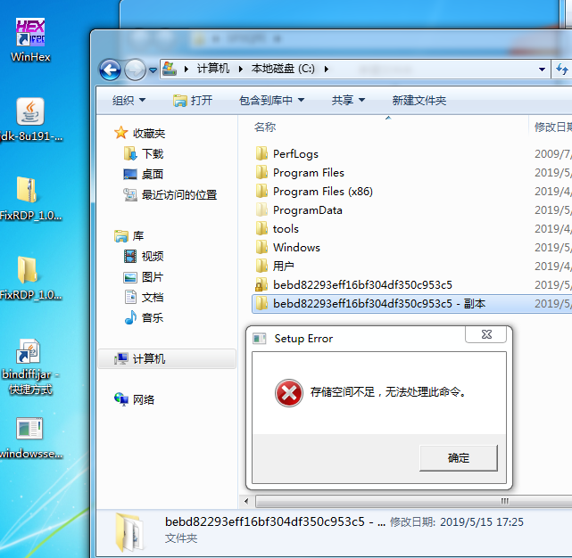
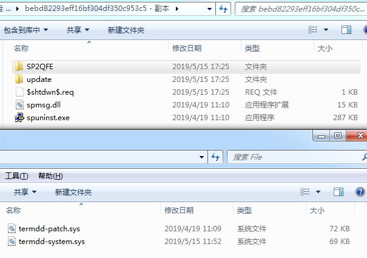
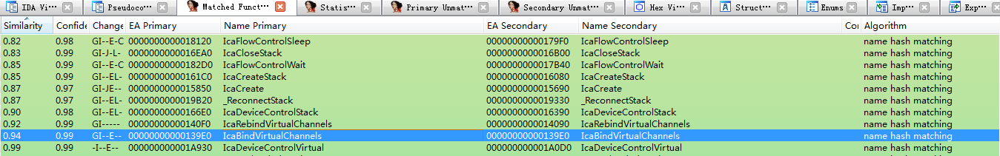
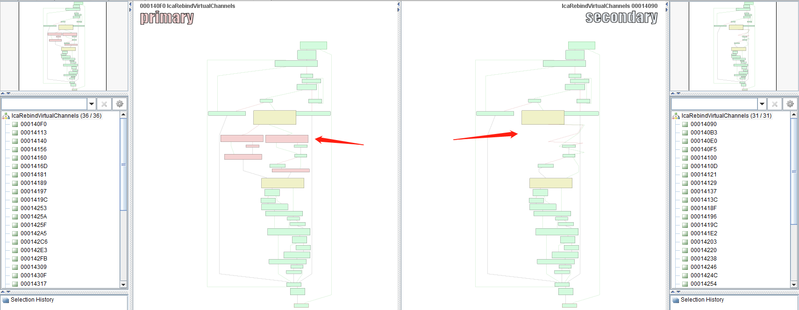
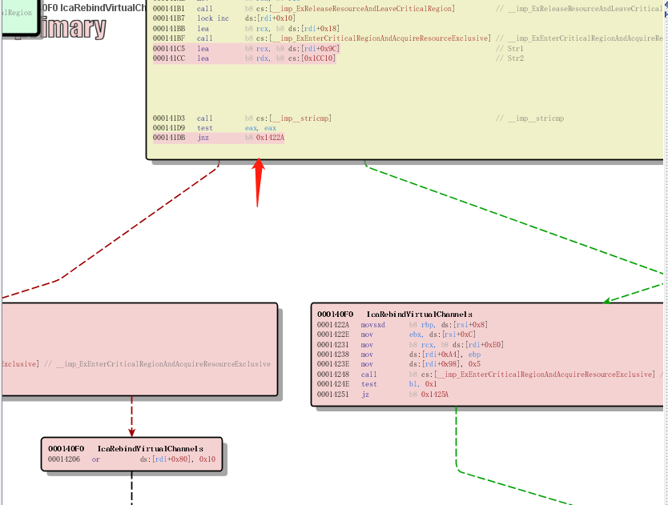
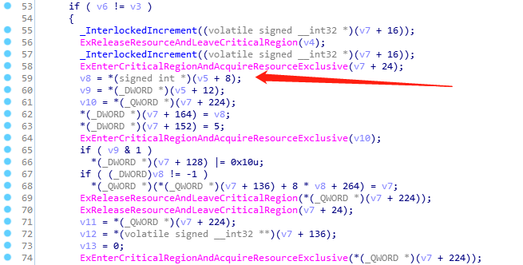
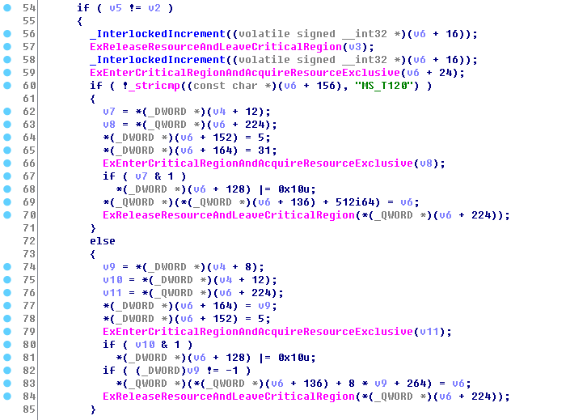
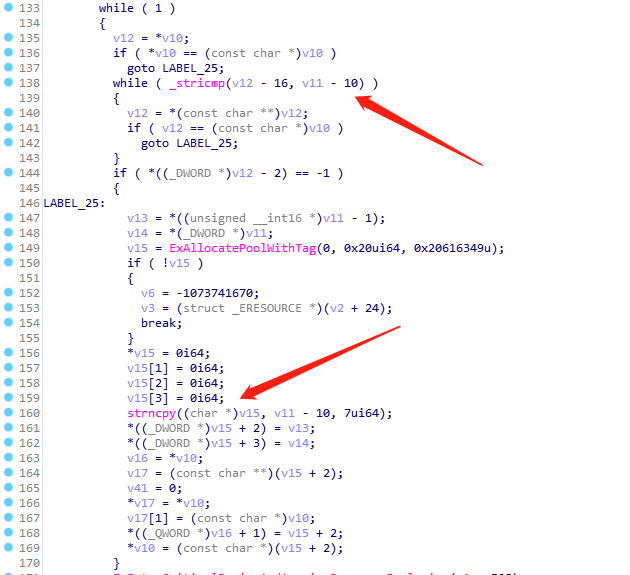

CVE-2019-0708 -RDP RCE

# 远程桌面服务代码执行漏洞分析

### Message

一个朋友圈引起了安全圈的疯狂转载，CVE-2019-0708就这样火了.

### Analysis

***通过各大搜索引擎，官方文档未得知该漏洞利用点，但是官网放出了补丁包【kb4500331】***

##### Step 1.  漏洞文件分析

准备IDA、Bindiff基础环境

双击补丁文件会在C盘跟目录产生随机的一个文件夹，Copy一个副本【补丁本身】

由于我的补丁是2003的，所以我从自己的2003系统Copy了一个补丁文件

放入IDA中，用Bindiff插件对比，发现微软对termdd.sys做了很多变动。

通过对变动代码分析，最终确认IcaBindVirtualChannels与IcaReBindVirtualChannels为漏洞产生位置【PS:因为在驱动文件中使用了_stricmp和strncpy非安全函数】

通过观察，发现在58行附近加入了判断，猜测判断某个参数位置是否为：MS_T120，是的话处理下，不是就执行原流程：

Bindiff 【IcaReBindVirtualChannels】 位置：

原始termdd.sys:

Patch termdd.sys:

但是通过后续再分析，漏洞利用位置为IcaBindVirtualChannels，微软对两个都做了修改，可能是为了兼容吧  :>

通过分析怀疑微软变相的认证了strncpy中的v11可控制，由此来确认该漏洞为RCE吧

##### Step 2. POC & Exploit

呵呵 ，别想吧 洗洗睡吧。

### Other

现在市面上的漏洞利用工具几乎都是假的，检测工具目测都是利用检测系统信息+有无补丁。

嗯，是这样，真实有点。充实的一天

